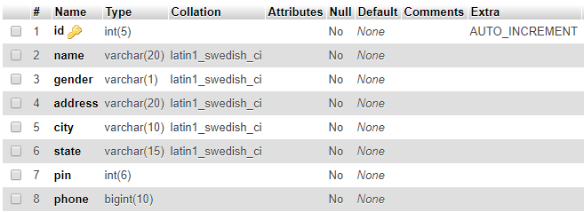
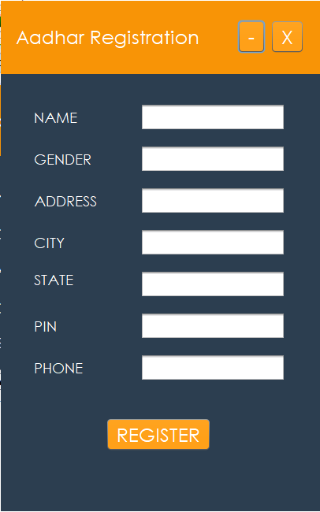
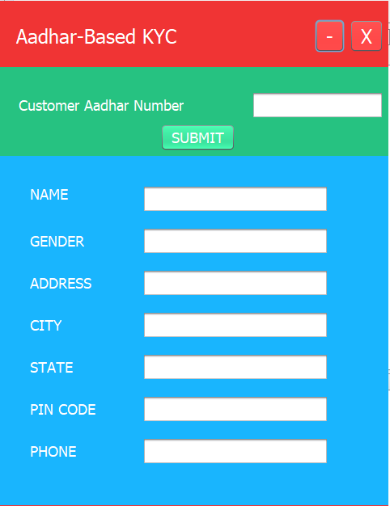

# Aadhar-KYC
A simple Java Swing x MySQL project that implements two forms: one for citizen registration, the other for KYC services.

Built as a fifth semester project for Object Oriented Programming using Java.
Requires a MySQL server to be running on localhost using something like XAMPP/WAMP Server.
Screenshots are as follows.

